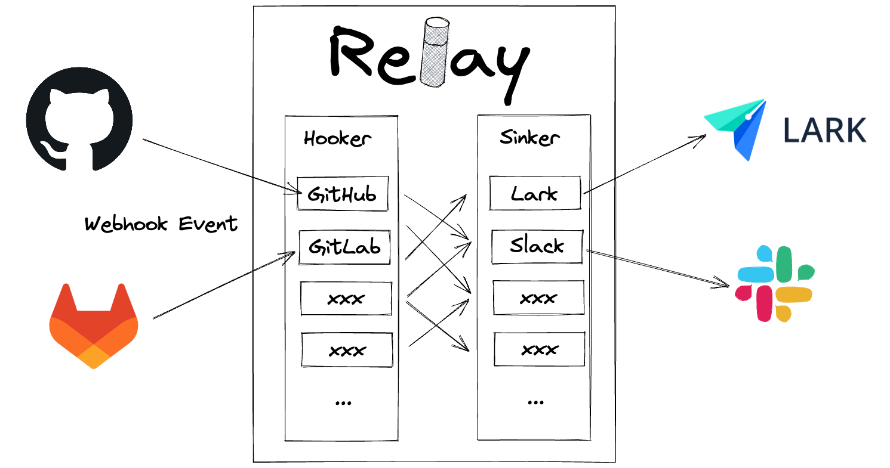

# Relay

</a>

<p align="center">
  <a href="https://goreportcard.com/report/github.com/bytebase/relay">
    
  </a>
</p>

Relay is a web server for forwarding events from service A to service B. While forwarding the event, it allows injecting arbitrary logic for processing the event such as filtering and augmenting.

You may think Relay as a very very simplified version of self hosted [Zapier](https://zapier.com).

# Overview

</a>

Relay Contains 2 components, Hooker and Sinker.

Hooker - Receive the webhook event from upstream services such as GitHub, GitLab, do some processing, and pass the processed payload to Sinker.

Sinker - Receive the payload from Hooker, do some processing, and send the event to downstream services such as Slack, Lark.

To relay an event from Service A to Service B, you would
1. Implement a Hooker to receive event from service A.
1. Implement a Sinker to process payload from that Hooker and send the processed message to Service B.
1. Register the Hooker to listen to event from service A and register the Sinker with the Hooker.

# Common Flags

#### `--address` (Env `RELAY_ADDR`)

The address where Relay runs. Default `localhost:5678`.

# Supported Hookers

## GitHub

*When configuring GitHub Webhook, make sure to set the webhook content type as `application/json`.*

### Flags

#### `--github-ref-prefix`

The prefix for the GitHub ref. GitHub Webhook iteself doesn't allow to specify a particular branch or branch filter. You can use `--github-ref-prefix` to only observe the events from the interested branch(es).

## Gerrit

### Flags

Currently we only support monitor one branch in one repository.

#### `--gerrit-repository`

Target repository. Will ignore the webhook message if the repository mismatched.

#### `gerrit-branch`

Target branch in the repository. Will ignore the webhook message if the branch mismatched.

# Supported Sinkers

## Lark

### Flags

#### `--lark-urls`

A comma-separated list of Lark message group webhook URLs.

## Bytebase

The Bytebase sinker will receive messages from the Gerrit hook, then create the issue for the SQL change.

### Flags

#### `--gerrit-url`

The Gerrit service URL. We need to call the Gerrit service to list files in the change, and get the file content in the change.

#### `--gerrit-account`

The Gerrit account name.

#### `--gerrit-password`

The Gerrit account password.

#### `--bytebase-url`

The Bytebase service URL. You can use the external URL in production.
Check the docs about external URL: https://www.bytebase.com/docs/get-started/install/external-url

#### `--bytebase-service-account`

The Bytebase service account. Used to call the Bytebase OpenAPI.

#### `--bytebase-service-key`

The Bytebase service key. Used to call the Bytebase OpenAPI.

# Quickstart

```sh
$ go run main.go --github-ref-prefix="refs/heads/release/" --lark-urls="https://open.feishu.cn/open-apis/bot/v2/hook/foo"

# --lark-url can also be a comma separated list
$ go run main.go --github-ref-prefix="refs/heads/release/" --lark-urls="https://open.feishu.cn/open-apis/bot/v2/hook/foo,https://open.feishu.cn/open-apis/bot/v2/hook/bar"

# Runs on localhost:8080
$ go run main.go --address=localhost:8080 --github-ref-prefix="refs/heads/release/" --lark-urls="https://open.feishu.cn/open-apis/bot/v2/hook/foo"
```
